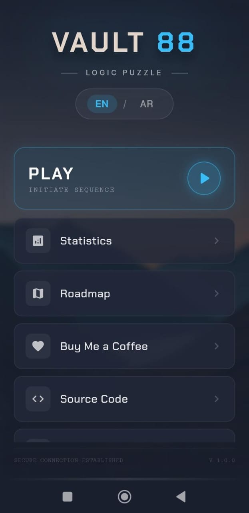
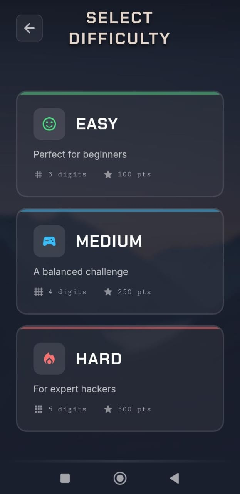
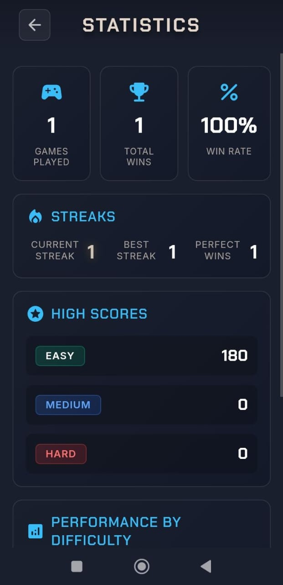

# Vault-88

Vault 88 is a premium "Cyber-Rustic" logic puzzle game. It combines the tactile satisfaction of physical wooden puzzles with a mysterious, cinematic atmosphere. It is designed to be a "daily ritual" game, similar to Wordle, but with deeper logical complexity.

## 📸 Screenshots

  
  
   
  
  
   
  

## Features

- **Three Difficulty Levels**: Easy (3 digits), Medium (4 digits), Hard (5 digits)
- **Visual Feedback System**: Wordle-inspired color-coded hints on each attempt
  - 🟢 Green glow: Correct digit in correct position
  - 🟡 Yellow glow: Correct digit in wrong position
  - 🔴 Red glow: Wrong digit (not in code)
- **Number Elimination Keyboard**: Toggle keypad to track which digits are ruled out
  - Auto-eliminates wrong digits after each attempt
  - Manual toggle for strategic planning
  - Collapsible interface for clean gameplay
- **Smart Hint System**: Request contextual hints to guide your solving (max 2 per game)
- **Dynamic Scoring**: Score based on time, wrong attempts, hints used, and perfection
- **Progression Tracking**: Track games played, wins, streaks, and performance per difficulty
- **High Scores**: Personal best scores saved for each difficulty level
- **Immersive Audio**: Background music and sound effects with volume controls
- **Bilingual Support**: Full English and Arabic (العربية) language support with RTL layout
- **Responsive Design**: Works seamlessly on desktop and mobile devices
- **Atmospheric Design**: Cyber-rustic aesthetic with smooth animations and glowing effects

## Roadmap

We're constantly working to improve Vault 88. Here's what's coming next:

### 🎯 Planned Features

#### **Online Leaderboards** 🏆
- Global leaderboards with real-time rankings
- Daily, weekly, and all-time high scores
- Compare your performance with players worldwide
- Country-specific leaderboards
- Achievement showcases on profiles

#### **PvP Mode** ⚔️
- Real-time multiplayer head-to-head challenges
- Race against friends or random opponents
- Matchmaking system based on skill level
- Live spectator mode
- Ranked competitive seasons with rewards

#### **New Game Modes** 🎮
- **Time Attack**: Solve as many codes as possible in 2 minutes
- **Zen Mode**: No timer, no penalties - pure puzzle solving
- **Daily Challenge**: Special codes with unique constraints
- **Marathon Mode**: Progressive difficulty with endless codes
- **Custom Codes**: Create and share your own challenges
- **Tournament Mode**: Structured bracket competitions

#### **Social Features** 👥
- Friends system
- Challenge friends directly
- Share your victories on social media
- Replay system to watch top solvers
- Community puzzles and contests

#### **Progression System** 📈
- Player levels and XP
- Unlockable themes and sound packs
- Profile customization
- Title and badge system
- Season pass with exclusive rewards

### 🔧 Technical Improvements
- Backend infrastructure for multiplayer
- Cloud save synchronization
- Performance optimizations
- Offline mode enhancements
- Cross-platform progression

---

**Status**: Currently in active development. Follow the repository for updates!

**Contribute**: We welcome feedback and suggestions. Open an issue to share your ideas!
